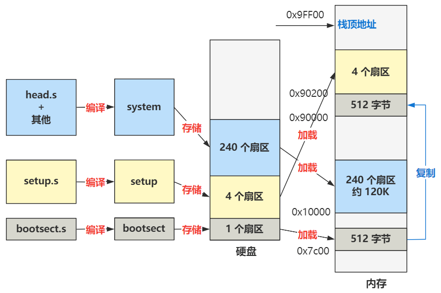
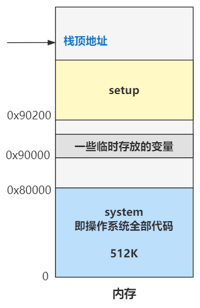

## 加载操作系统到内存

### 各程序在磁盘扇区的位置

***1.*** 把 bootsect.s 编译成 bootsect 放在硬盘的 1 扇区。

***2.*** 把 setup.s 编译成 setup 放在硬盘的 2~5 扇区。

***3.*** 把剩下的全部代码（head.s 作为开头）编译成 system 放在硬盘的随后 240 个扇区。

### 主要加载流程

#### BIOS执行最初的程序

当你按下开机键的那一刻，在主板上提前写死的固件程序 **BIOS** 会将硬盘中**启动区的 512 字节**的数据，原封不动复制到**内存中的 0x7c00** 这个位置，并跳转到那个位置进行执行。

> 启动区的定义非常简单，只要硬盘中的 0 盘 0 道 1 扇区的 512 个字节的最后两个字节分别是 **0x55** 和 **0xaa**，那么 BIOS 就会认为它是个启动区。

首先把磁盘第一个扇区加载到内存地址为**0x07c0**的地方（也就是**0x7c00**，x86只有16位寄存器，为了能访问到20位地址线使用的特殊计算方式。（即**段地址×16+偏移地址，**也就是段地址×10H＋偏移地址）（以下地址全部使用偏移后的地址 ）

#### 先执行bootsect 

把内存地址**0x7c00**，大小为512字节（一个扇区）复制到内存地址为**0x90000**中。

然后将**数据段寄存器 ds** 和**代码段寄存器 cs**设置为了 **0x90000**，栈顶地址被设置为 **0x9FF00**（**栈段寄存器 ss** 为 **0x90000**，**栈基址寄存器 sp** 为 **0xFF00**。栈是向下发展的）。

最后2，3，4，5个扇区加载到内存地址为**0x90200**的地方（即由 setup.s 编译而来的程序），其他代码编译的程序加载到内存地址为**0x10000**的地方，跳转到**setup** (即0x90200)。

#### 再执行setup

主要作用是重新分布内存布局以及将一些变量、设备信息存储在内存中

| 内存地址 | 长度(字节) | 名称         |
| -------- | ---------- | ------------ |
| 0x90000  | 2          | 光标位置     |
| 0x90002  | 2          | 扩展内存数   |
| 0x90004  | 2          | 显示页面     |
| 0x90006  | 1          | 显示模式     |
| 0x90007  | 1          | 字符列数     |
| 0x90008  | 2          | 未知         |
| 0x9000A  | 1          | 显示内存     |
| 0x9000B  | 1          | 显示状态     |
| 0x9000C  | 2          | 显卡特性参数 |
| 0x9000E  | 1          | 屏幕行数     |
| 0x9000F  | 1          | 屏幕列数     |
| 0x90080  | 16         | 硬盘1参数表  |
| 0x90090  | 16         | 硬盘2参数表  |
| 0x901FC  | 2          | 根设备号     |

