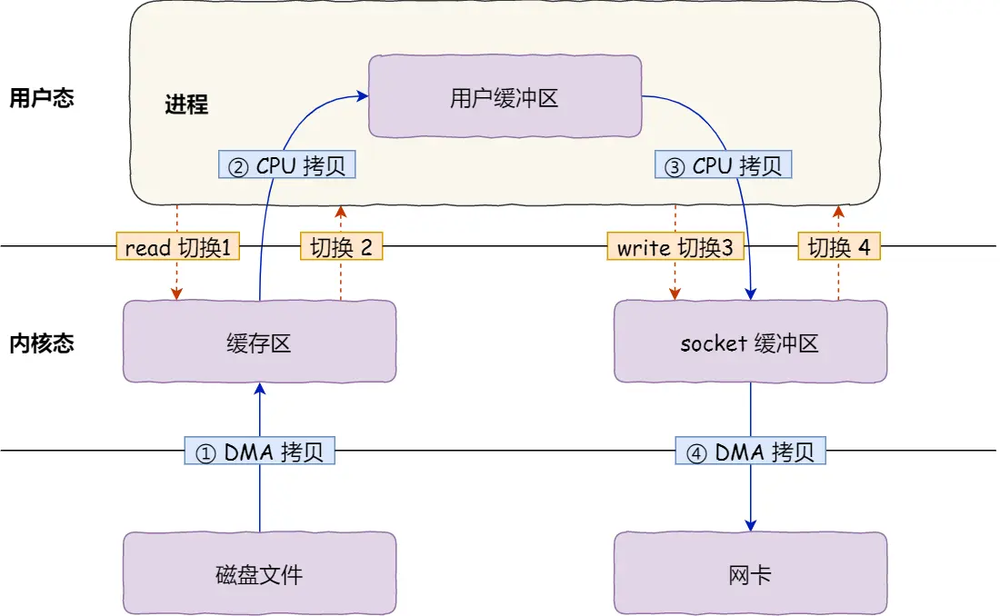
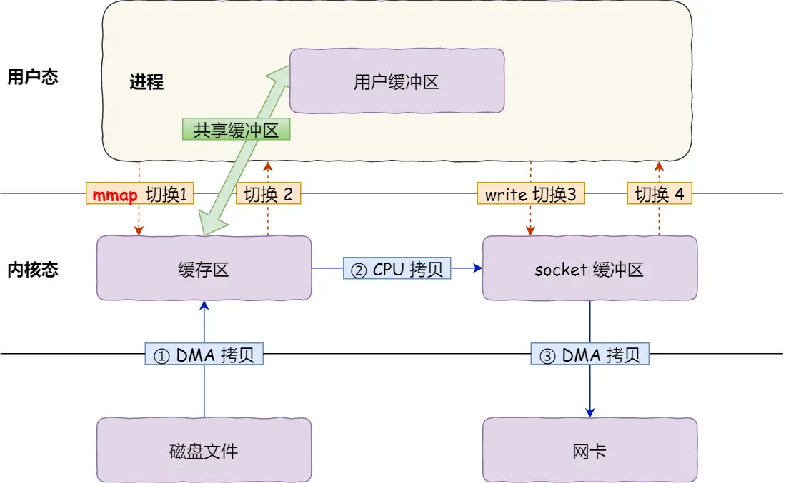
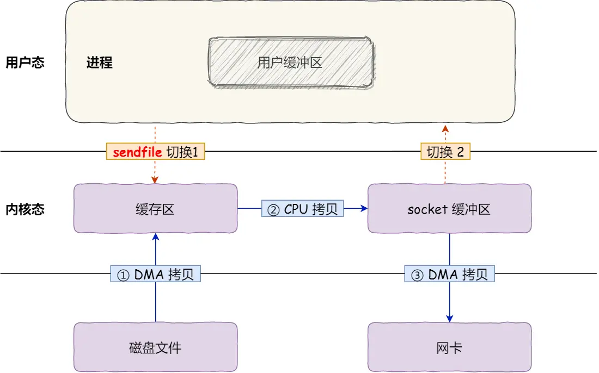
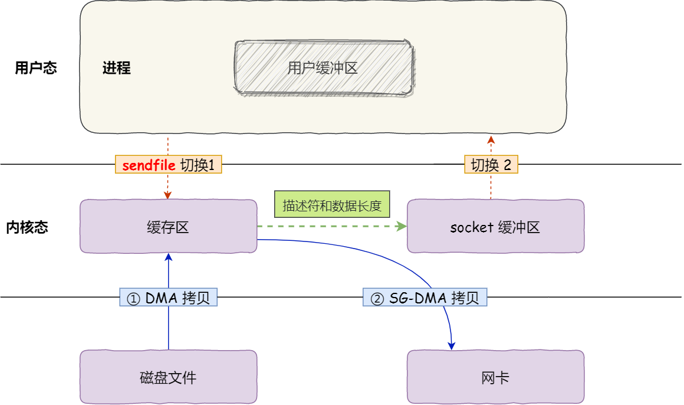
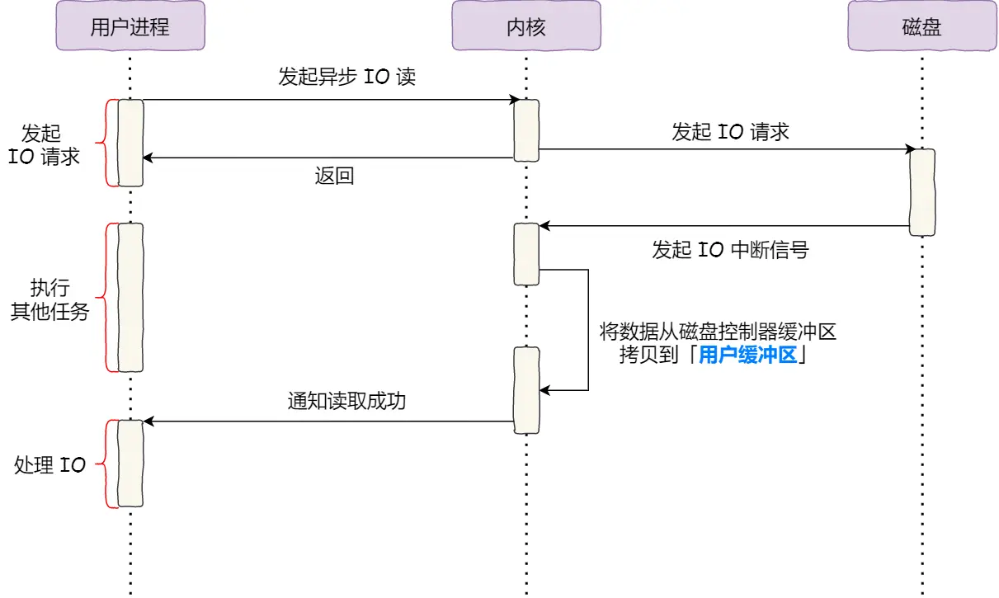
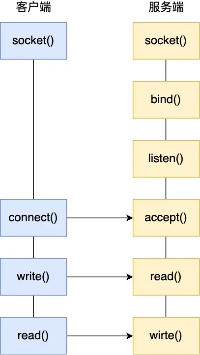
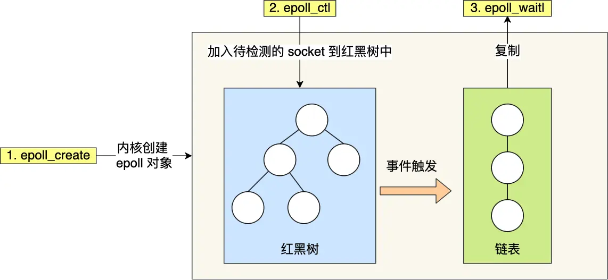

## 零拷贝

传统的网络文件传输需要两次系统调用（四次内核态用户态切换），四次数据拷贝



传统的文件传输方式会历经 4 次数据拷贝，而且这里面，「从内核的读缓冲区拷贝到用户的缓冲区里，再从用户的缓冲区里拷贝到 socket 的缓冲区里」，这个过程是没有必要的。

因为文件传输的应用场景中，在用户空间我们并不会对数据「再加工」，所以数据实际上可以不用搬运到用户空间，因此**用户的缓冲区是没有必要存在的**。

### 两种零拷贝方式

1. mmap + write
2. sendfile

### mmap + write

`mmap()` 系统调用函数会直接把内核缓冲区里的数据「**映射**」到用户空间，这样，操作系统内核与用户空间就不需要再进行任何的数据拷贝操作。



但这还不是最理想的零拷贝，因为仍然需要通过 CPU 把内核缓冲区的数据拷贝到 socket 缓冲区里，而且仍然需要 4 次上下文切换，因为系统调用还是 2 次。

### sendfile

在 Linux 内核版本 2.1 中，提供了一个专门发送文件的系统调用函数 `sendfile()`，函数形式如下：

```c
#include <sys/socket.h>
ssize_t sendfile(int out_fd, int in_fd, off_t *offset, size_t count);
```

它的前两个参数分别是目的端和源端的文件描述符，后面两个参数是源端的偏移量和复制数据的长度，返回值是实际复制数据的长度。

首先，它可以替代前面的 `read()` 和 `write()` 这两个系统调用，这样就可以减少一次系统调用，也就减少了 2 次上下文切换的开销。

其次，该系统调用，可以直接把内核缓冲区里的数据拷贝到 socket 缓冲区里，不再拷贝到用户态，这样就只有 2 次上下文切换，和 3 次数据拷贝。如下图：



#### SG-DMA（*The Scatter-Gather Direct Memory Access*）技术

于是，从 Linux 内核 `2.4` 版本开始起，对于支持网卡支持 SG-DMA 技术的情况下， `sendfile()` 系统调用的过程发生了点变化，具体过程如下：

- 第一步，通过 DMA 将磁盘上的数据拷贝到内核缓冲区里；
- 第二步，缓冲区描述符和数据长度传到 socket 缓冲区，这样网卡的 SG-DMA 控制器就可以直接将内核缓存中的数据拷贝到网卡的缓冲区里，此过程不需要将数据从操作系统内核缓冲区拷贝到 socket 缓冲区中，这样就减少了一次数据拷贝；

所以，这个过程之中，只进行了 2 次数据拷贝，如下图：



这就是所谓的**零拷贝技术，因为我们没有在内存层面去拷贝数据，也就是说全程没有通过 CPU 来搬运数据，所有的数据都是通过 DMA 来进行传输的。**。

零拷贝技术的文件传输方式相比传统文件传输的方式，减少了 2 次上下文切换和数据拷贝次数，**只需要 2 次上下文切换和数据拷贝次数，就可以完成文件的传输，而且 2 次的数据拷贝过程，都不需要通过 CPU，2 次都是由 DMA 来搬运。**

所以，总体来看，**零拷贝技术可以把文件传输的性能提高至少一倍以上**。

### 应用的开源项目

#### Kafka 和 Nginx

追溯 Kafka 文件传输的代码，你会发现，最终它调用了 Java NIO 库里的 `transferTo` 方法：

```java
@Overridepublic 
long transferFrom(FileChannel fileChannel, long position, long count) throws IOException { 
    return fileChannel.transferTo(position, count, socketChannel);
}
```

如果 Linux 系统支持 `sendfile()` 系统调用，那么 `transferTo()` 实际上最后就会使用到 `sendfile()` 系统调用函数。

Nginx 也支持零拷贝技术，一般默认是开启零拷贝技术，这样有利于提高文件传输的效率，是否开启零拷贝技术的配置如下：

```text
http {
...
    sendfile on
...
}
```

sendfile 配置的具体意思:

- 设置为 on 表示，使用零拷贝技术来传输文件：sendfile ，这样只需要 2 次上下文切换，和 2 次数据拷贝。
- 设置为 off 表示，使用传统的文件传输技术：read + write，这时就需要 4 次上下文切换，和 4 次数据拷贝。

当然，要使用 sendfile，Linux 内核版本必须要 2.1 以上的版本。

### PageCache

回顾前面说道文件传输过程，其中第一步都是先需要先把磁盘文件数据拷贝「内核缓冲区」里，这个「内核缓冲区」实际上是**磁盘高速缓存（PageCache）**。

由于零拷贝使用了 PageCache 技术，可以使得零拷贝进一步提升了性能。

- **PageCache 缓存最近被访问的数据**，当空间不足时淘汰最久未被访问的缓存。
- **PageCache 使用了「预读功能」**

#### 优点

PageCache 的优点主要是两个：

- 缓存最近被访问的数据；
- 预读功能；

这两个做法，将大大提高读写磁盘的性能。

#### 大文件不适用

**但是，在传输大文件（GB 级别的文件）的时候，PageCache 会不起作用，那就白白浪费 DMA 多做的一次数据拷贝，造成性能的降低，即使使用了 PageCache 的零拷贝也会损失性能**

这是因为如果你有很多 GB 级别文件需要传输，每当用户访问这些大文件的时候，内核就会把它们载入 PageCache 中，于是 PageCache 空间很快被这些大文件占满。

另外，由于文件太大，可能某些部分的文件数据被再次访问的概率比较低，这样就会带来 2 个问题：

- PageCache 由于长时间被大文件占据，其他「热点」的小文件可能就无法充分使用到 PageCache，于是这样磁盘读写的性能就会下降了；
- PageCache 中的大文件数据，由于没有享受到缓存带来的好处，但却耗费 DMA 多拷贝到 PageCache 一次；

### 大文件传输方式

因为大文件传输时，采用同步I/O的话，阻塞时间过长，所以采用异步I/O



**在高并发的场景下，针对大文件的传输的方式，应该使用「异步 I/O + 直接 I/O」来替代零拷贝技术**。

我们可以发现，异步 I/O 并没有涉及到 PageCache，所以使用异步 I/O 就意味着要绕开 PageCache。

绕开 PageCache 的 I/O 叫直接 I/O，使用 PageCache 的 I/O 则叫缓存 I/O。通常，对于磁盘，异步 I/O 只支持直接 I/O。

前面也提到，大文件的传输不应该使用 PageCache，因为可能由于 PageCache 被大文件占据，而导致「热点」小文件无法利用到 PageCache。

#### 直接 I/O 应用场景常见的两种

- 应用程序已经实现了磁盘数据的缓存，那么可以不需要 PageCache 再次缓存，减少额外的性能损耗。在 MySQL 数据库中，可以通过参数设置开启直接 I/O，默认是不开启；
- 传输大文件的时候，由于大文件难以命中 PageCache 缓存，而且会占满 PageCache 导致「热点」文件无法充分利用缓存，从而增大了性能开销，因此，这时应该使用直接 I/O。

缺点

由于直接 I/O 绕过了 PageCache，无法享受内核的这两点的优化：

- 内核的 I/O 调度算法会缓存尽可能多的 I/O 请求在 PageCache 中，最后「**合并**」成一个更大的 I/O 请求再发给磁盘，这样做是为了减少磁盘的寻址操作；
- 内核也会「**预读**」后续的 I/O 请求放在 PageCache 中，一样是为了减少对磁盘的操作；

传输文件的时候，我们要根据文件的大小来使用不同的方式：

- 传输大文件的时候，使用「异步 I/O + 直接 I/O」；
- 传输小文件的时候，则使用「零拷贝技术」；

### 总结

在 nginx 中，我们可以用如下配置，来根据文件的大小来使用不同的方式：

```text
location /video/ { 
    sendfile on; 
    aio on; 
    directio 1024m; 
}
```

当文件大小大于 `directio` 值后，使用「异步 I/O + 直接 I/O」，否则使用「零拷贝技术」

## I/O 多路复用

### 服务端

服务端首先调用 `socket()` 函数，创建网络协议为 IPv4，以及传输协议为 TCP 的 Socket ，接着调用 `bind()` 函数，给这个 Socket 绑定一个 **IP 地址和端口**，绑定这两个的目的是什么？

- 绑定端口的目的：当内核收到 TCP 报文，通过 TCP 头里面的端口号，来找到我们的应用程序，然后把数据传递给我们。
- 绑定 IP 地址的目的：一台机器是可以有多个网卡的，每个网卡都有对应的 IP 地址，当绑定一个网卡时，内核在收到该网卡上的包，才会发给我们；

绑定完 IP 地址和端口后，就可以调用 `listen()` 函数进行监听，此时对应 TCP 状态图中的 `listen`，如果我们要判定服务器中一个网络程序有没有启动，可以通过 `netstat` 命令查看对应的端口号是否有被监听。

服务端进入了监听状态后，通过调用 `accept()` 函数，来从内核获取客户端的连接，如果没有客户端连接，则会阻塞等待客户端连接的到来。

### 客户端

那客户端是怎么发起连接的呢？客户端在创建好 Socket 后，调用 `connect()` 函数发起连接，该函数的参数要指明服务端的 IP 地址和端口号，然后万众期待的 TCP 三次握手就开始了。

### Socket队列

在  TCP 连接的过程中，服务器的内核实际上为每个 Socket 维护了两个队列：

- 一个是「还没完全建立」连接的队列，称为 **TCP 半连接队列**，这个队列都是没有完成三次握手的连接，此时服务端处于 `syn_rcvd` 的状态；
- 一个是「已经建立」连接的队列，称为 **TCP 全连接队列**，这个队列都是完成了三次握手的连接，此时服务端处于 `established` 状态；

当 TCP 全连接队列不为空后，服务端的 `accept()` 函数，就会从内核中的 TCP 全连接队列里拿出一个已经完成连接的  Socket 返回应用程序，后续数据传输都用这个 Socket。

注意，监听的 Socket 和真正用来传数据的 Socket 是两个：

- 一个叫作**监听 Socket**；
- 一个叫作**已连接 Socket**；



### select 和 poll

select 实现多路复用的方式是，将已连接的 Socket 都放到一个**文件描述符集合**，然后调用 select 函数将文件描述符集合**拷贝**到内核里，让内核来检查是否有网络事件产生，检查的方式很粗暴，就是通过**遍历**文件描述符集合的方式，当检查到有事件产生后，将此 Socket 标记为可读或可写， 接着再把整个文件描述符集合**拷贝**回用户态里，然后用户态还需要再通过**遍历**的方法找到可读或可写的 Socket，然后再对其处理。

select 这种方式，需要进行 **2 次「遍历」文件描述符集合**，一次是在内核态里，一个次是在用户态里 ，而且还会发生 **2 次「拷贝」文件描述符集合**，先从用户空间传入内核空间，由内核修改后，再传出到用户空间中。

select 使用固定长度的 BitsMap，表示文件描述符集合，而且所支持的文件描述符的个数是有限制的，在 Linux 系统中，由内核中的 FD_SETSIZE 限制， 默认最大值为 `1024`，只能监听 0~1023 的文件描述符。

poll 不再用 BitsMap 来存储所关注的文件描述符，取而代之用动态数组，以链表形式来组织，突破了 select 的文件描述符个数限制，当然还会受到系统文件描述符限制。

但是 poll 和 select 并没有太大的本质区别，**都是使用「线性结构」存储进程关注的 Socket 集合，因此都需要遍历文件描述符集合来找到可读或可写的 Socket，时间复杂度为 O(n)，而且也需要在用户态与内核态之间拷贝文件描述符集合**，这种方式随着并发数上来，性能的损耗会呈指数级增长。

### epoll

#### 用法

如下的代码中，先用epoll_create 创建一个 epoll 对象 epfd，再通过 epoll_ctl 将需要监视的 socket 添加到epfd中，最后调用 epoll_wait 等待数据。

```c
int s = socket(AF_INET, SOCK_STREAM, 0);
bind(s, ...);
listen(s, ...)

int epfd = epoll_create(...);
epoll_ctl(epfd, ...); //将所有需要监听的socket添加到epfd中

while(1) {
    int n = epoll_wait(...);
    for(接收到数据的socket){
        //处理
    }
}
```

#### 优点

- epoll 在内核里使用**红黑树来跟踪进程所有待检测的文件描述字**，epoll 因为在内核维护了红黑树，可以保存所有待检测的 socket ，所以只需要传入一个待检测的 socket，减少了内核和用户空间大量的数据拷贝和内存分配。
-  epoll 使用**事件驱动**的机制，内核里**维护了一个链表来记录就绪事件**，当某个 socket 有事件发生时，通过**回调函数**内核会将其加入到这个就绪事件列表中，当用户调用 `epoll_wait()` 函数时，只会返回有事件发生的文件描述符的个数，不需要像 select/poll 那样轮询扫描整个 socket 集合，大大提高了检测的效率。



#### LT（水平触发） 和 ET（边缘触发）

- 使用边缘触发模式时，当被监控的 Socket 描述符上有可读事件发生时，**服务器端只会从 epoll_wait 中苏醒一次**，即使进程没有调用 read 函数从内核读取数据，也依然只苏醒一次，因此我们程序要保证一次性将内核缓冲区的数据读取完；
- 使用水平触发模式时，当被监控的 Socket 上有可读事件发生时，**服务器端不断地从 epoll_wait 中苏醒，直到内核缓冲区数据被 read 函数读完才结束**，目的是告诉我们有数据需要读取；

## 一致性哈希

不同的负载均衡算法适用的业务场景也不同的。

轮询这类的策略只能适用与每个节点的数据都是相同的场景，访问任意节点都能请求到数据。但是不适用分布式系统，因为分布式系统意味着数据水平切分到了不同的节点上，访问数据的时候，一定要寻址存储该数据的节点。

哈希算法虽然能建立数据和节点的映射关系，但是每次在节点数量发生变化的时候，最坏情况下所有数据都需要迁移，这样太麻烦了，所以不适用节点数量变化的场景。

为了减少迁移的数据量，就出现了一致性哈希算法。

一致性哈希是指将「存储节点」和「数据」都映射到一个首尾相连的哈希环上，如果增加或者移除一个节点，仅影响该节点在哈希环上顺时针相邻的后继节点，其它数据也不会受到影响。

但是一致性哈希算法不能够均匀的分布节点，会出现大量请求都集中在一个节点的情况，在这种情况下进行容灾与扩容时，容易出现雪崩的连锁反应。

为了解决一致性哈希算法不能够均匀的分布节点的问题，就需要引入虚拟节点，对一个真实节点做多个副本。不再将真实节点映射到哈希环上，而是将虚拟节点映射到哈希环上，并将虚拟节点映射到实际节点，所以这里有「两层」映射关系。

引入虚拟节点后，可以会提高节点的均衡度，还会提高系统的稳定性。所以，带虚拟节点的一致性哈希方法不仅适合硬件配置不同的节点的场景，而且适合节点规模会发生变化的场景。