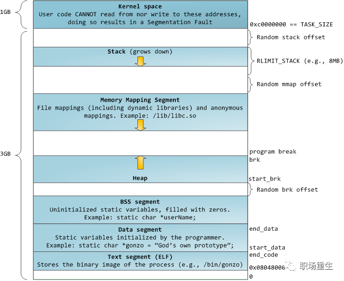
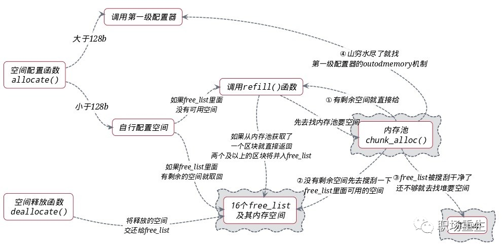
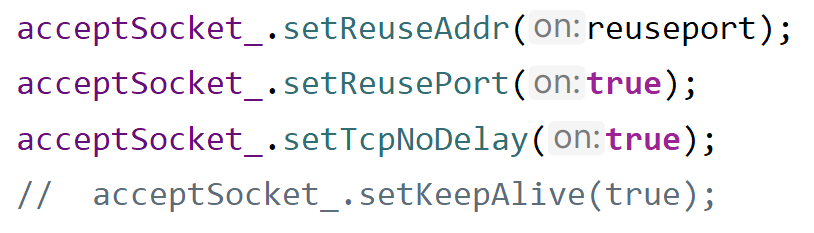
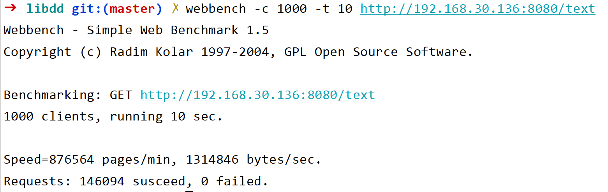
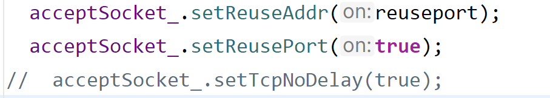
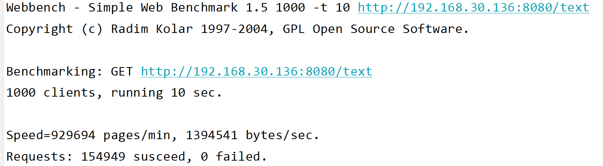

## C++

### 特殊发现--谈资

#### std::bind

当bind函数作为参数时，可以无视传入参数（std::function的具体类型）的类型限制

```c++
#include <bits/stdc++.h>

using namespace std;

void test(const function<void(int)> &func) { func(1); }

void func1(const void *data, size_t len) {
  cout << "data: " << data << endl;
  cout << "len: " << len << endl;
}

void func2(int n) { cout << "n: " << n << endl; }

class A {};

int main() {
  auto p1 = func1;
  auto p2 = func2;
  void *data;
  size_t len;
  test(bind(p1, data, len));
  test(bind(p2, 1));
//test([](const void *data, size_t len) { func1(data, len); });  报错
}
```

```
// 运行结果
data: 0
len: 0
n: 1
```

如示例，test的参数要求为const function<void(int)>&，代码21行处传入经bind()绑定后的函数指针，该指针类型为void(const void *,size_t)，结果可以运行，但是结果不可预测，若是正确传参，**可正常运行**。


#### Linux内核常用unsigned long来代替指针

```c
 /* Look up the first VMA which satisfies  addr < vm_end,  
NULL if none. */
struct vm_area_struct *find_vma(
                        struct mm_struct *mm, 
                        unsigned long addr)；
```

比如示例函数，addr是由unsigned long表示的，目的是为了**防止像指针一样解引用**，防止修改指针指向地址的值（当然可以强制转换为指针，再进行解引用，但是一般人看到unsigned long就不会想到再去转换为指针了）

> 它的科学依据是，既然你不是为了dereferencing，我就让你dereferencing不了，免得你又跑去dereferencing，从而导致bug。有的人说，我强制转化unsigned long为指针，不就可以访问了吗？
>
> 你不是还是需要强制转换不是？你强制转换之前，会想一下，**这个地方指针为啥是个整数呢？你想明白了，说不定就不去访问了。**这样它实际达到了震慑心灵的效果。
>
> ​									    -------宋宝华：为什么Linux内核常常用unsigned long来代替指针          


### **对象模型**

#### 各个代码段的作用

##### .bss

Block（b） Started（s） by Symbol（s）

存储一些未被初始化的全局变量和静态变量的内存区域，不包含任何数据，只是简单的维护开始和结束的地址，以便内存区能在运行时被有效的清零。并不给该段的数据分配空间，只是**记录数据所需空间的大小**。不占用可执行文件的空间，BSS段在应用程序的二进制映像文件中并不存在。

##### .data

又称为数据段，通常是指用来存放程序中已被初始化的全局变量，常量，静态变量的一块内存区域。也就是我们通常说的静态存储区。

- 注意：data段为数据分配空间，数据保存在目标文件中。
- 特点：可读写。

##### .text （textsegment）

也叫代码段。通常指用来存放程序执行代码的一块内存区域，这部分区域的大小在程序运行前就已经确定，并且内存区域通常属于只读。

- 在代码段中，也有可能包含一些只读的常数变量，例如字符串常量等。
- 特点：只读

##### .rodata

该段也叫常量区，用于存放常量数据，ro就是read only（只读）。

**虚函数表**也存在于此处

注意：并不是所有的常量都放在常量数据段，特殊情况如下

-  有些**立即数与指令编译**在一起放在代码段
-  对于字符串常量，编译器会自动去掉重复的字符串，保证一个字符串在一个可执行文件(EXE/SO)中只存在一份拷贝。

#### 用户内存空间



- stack栈区：专门用来实现函数调用-栈结构的内存块。相对空间下（可以设置大小，Linux 一般默认是8M，可通过 ulimit –s 查看），系统自动管理，从高地址往低地址，向下生长。
- 内存映射区：包括文件映射和匿名内存映射，  应用程序的所依赖的动态库，会在程序执行时候，加载到内存这个区域，一般包括数据（data）和代码（text）;通过mmap系统调用，可以把特定的文件映射到内存中，然后在相应的内存区域中操作字节来访问文件内容，实现更高效的IO操作；匿名映射，在glibc中malloc分配大内存的时候会用到匿名映射。这里所谓的“大”表示是超过了`MMAP_THRESHOLD` 设置的字节数，它的缺省值是 128 kB，可以通过 `mallopt()` 去调整这个设置值。还可以用于进程间通信IPC（共享内存）。
- heap堆区：主要用于用户动态内存分配，空间大，使用灵活，但需要用户自己管理，通过brk系统调用控制堆的生长，向高地址生长。
- BBS段和DATA段：用于存放程序全局数据和静态数据，一般未初始化的放在BSS段（统一初始化为0，不占程序文件的空间），初始化的放在data段，只读数据放在rodata段（常量存储区）。
- text段：主要存放程序二进制代码。

### **内存管理**

#### STL内存分配




#### **内存池技术**

普通的new/delete（malloc/free）容易产生大量的内存碎片

  内存池方案通常一次从系统申请一大块内存块，然后基于在这块内存块可以进行不同内存策略实现，可以比较好得解决上面提到的问题，一般采用内存池有以下好处：


​    1.少量系统申请次数，非常少(几没有) 堆碎片。
​    2.由于没有系统调用等，比通常的内存申请/释放(比如通过malloc, new等)的方式快。
​    3.可以检查应用的任何一块内存是否在内存池里。
​    4.写一个”堆转储(Heap-Dump)”到你的硬盘(对事后的调试非常有用)。
​    5.可以更方便实现某种内存泄漏检测(memory-leak detection)。
​    6.减少额外系统内存管理开销，可以节约内存；


### **SGI STL** 

### **Modern C++**

---------------------------------------------------------------------------------

## Mysql

### **索引**

### **锁**

### **事务**

### **MVCC**

--------------------------------------------------------------------------

## **操作系统**

### **进程**、线程、协程

- 进程有自己的独立地址空间，线程没有
- 进程是资源分配的最小单位，线程是CPU调度的最小单位
- 线程的通信比较方便，同一进程的线程共享数据(如全局变量，静态变量)
- 进程上下文切换开销比线程上下文切换开销大
- 一个进程挂了不会影响其他进程，而线程挂了会影响其他线程


协程解决的问题

- 上下文切换成本和线程创建销毁成本

- 异步编程复杂性

业务处理时间远小于 IO 耗时，切换非常频繁，那么使用协程是不错的选择

多协程会比多线程更轻量，但不代表多协程的性能是最好的

-   用不用协程，线程本身都是要上下文切换的，用了协程反而多了协程切换成本

-   IO多路复用+线程池的性能会比协程的更好，但是协程对开发者来说友好得多

### **进程间通信**

### **虚拟内存**

### **零拷贝**

----------------------------------------------------------------------------------

## **计算机网络**

### **面经**

### HTTP/HTTPS

### TCP

### UDP

### DNS

----------------------------------------------------------------------------------

## 项目

### libdd

项目中用到的同步/措施 mutex（lock_guard包装）和条件变量(condition_variable)、信号量（sem_t）

lock_guard：将mutex包装成对象，用RAII的原则管理，退出作用域自动解锁，是异常安全的

```c++
// 主要使用方式
{
std::lock_guard<std::mutex> lock(*mutex_);
......
}
cond_.wait(lock);
cond_.notify_one();
```

条件变量

- cond_wait：阻塞或当前进程直到背notify
- notify_one：将当前条件变量绑定的等待队列中唤醒一个进程/线程

```c++
// ......执行某些任务-创建loop
{
  // 等待新线程执行threadFunc完毕，所以使用cond_.wait
  std::unique_lock<std::mutex> lock(mutex_);
  while (loop_ == nullptr) {
    cond_.wait(lock);
  }
  loop = loop_;
}
```

```c++
{
  std::unique_lock<std::mutex> lock(mutex_);
  loop_ = &loop;  // 等到生成EventLoop对象之后才唤醒
  cond_.notify_one();
}
```

sem


#### epoll惊群

惊群即当一个事件发生后，大量的进程/线程被唤醒

##### 多进程公用一个epoll实例

epoll在多进程共用一个epoll的LT模式下会出现惊群现象，原因在于

- 
  遍历并清空epoll的ready list，遍历过程中，对于每个epi收集其返回的events，如果没收集到event，则continue去处理其他epi，否则将当前epi的事件和用户传入的数据都copy给用户空间，并判断，如果是在LT模式下，则将当前epi重新放回epoll的ready list

- 遍历epoll的ready list完成后，如果ready list不为空，则继续唤醒epoll睡眠队列wq上的其他task B。task B从epoll_wait醒来继续前行，重复上面的流程，继续唤醒wq上的其他task C，这样链式唤醒下去。

> epoll 可以监控多个 fd 的事件，它通过一颗红黑树来组织所有被 epoll_ctl 加入到 epoll 监听列表中的 fd，每个被监听的 fd 在 epoll 用一个 epoll item(epi)来标识。

ET模式下带来一种类"惊群"现象

A、B、C三个进程在监听listen fd的EPOLLIN事件，都睡眠在epoll_wait上，都是ET模式。
[1] listen fd上一个请求C_1上来，该请求唤醒了A进程，A进程从epoll_wait返回准备去accept该请求来处理。
[2] 这个时候，第二个请求C_2上来，由于睡眠队列上是B、C，于是epoll唤醒B进程，B进程从epoll_wait返回准备去accept该请求来处理。
[3] A进程在自己的accept循环中，首选accept得到C_1，接着A进程在第二个循环继续accept，继续得到C_2。
[4] B进程在自己的accept循环中，调用accept，由于C_2已经被A拿走了，于是B进程accept返回EAGAIN错误，于是B进程退出accept流程重新睡眠在epoll_wait上。
[5] A进程继续第三个循环，这个时候已经没有请求了， accept返回EAGAIN错误，于是A进程也退出accept处理流程，进入请求的处理流程。

可以看到，**B 进程被唤醒了，但是并没有事情可以做，同时，epoll 的 ET 这样的处理模式，负载容易出现不均衡。**

##### 多进程独立epoll实例

[1] 由于相对同一个listen fd而言， 多个进程之间的epoll是平等的，于是，listen fd上的一个请求上来，会唤醒所有睡眠在listen fd睡眠队列上的epoll，epoll又唤醒对应的进程task，从而唤醒所有的进程(这里不管listen fd是以LT还是ET模式加入到epoll)。
[2] 多个进程间的epoll是独立的，对epoll fd的相关epoll_ctl操作相互独立不影响。

**EPOLLEXCLUSIVE 排他唤醒 Epoll**

linux4.5 以后的内核版本中，增加了 EPOLLEXCLUSIVE， 该选项只能通过 EPOLL_CTL_ADD 对需要监控的 fd(例如 listen fd)设置 EPOLLEXCLUSIVE 标记。这样 epoll entry 是通过排他方式挂载到 listen fd  等待队列的尾部的，睡眠在 listen fd 的等待队列上的 epoll entry 会加上 WQ_FLAG_EXCLUSIVE  标记。根据前面介绍的内核 wake up 机制，listen fd 上的事件上来，在遍历并唤醒等待队列上的 entry  的时候，遇到并唤醒第一个带 WQ_FLAG_EXCLUSIVE 标记的 entry 后，就结束遍历唤醒过程。于是，多进程独立 epoll  的"惊群"问题得到解决。

#### SO_REUSEPORT

reuseport 也是内核解决 `惊群问题` 的优秀方案。

1. 每个进程可以 bind/listen 相同的 IP/PORT，相当于每个进程拥有独立的 listen socket 的完全队列，避免了共享 listen socket 的资源争抢，提升了并发的吞吐。
2. 内核通过哈希算法，将新链接相对均衡地分配到各个开启了 reuseport 属性的进程，所以资源的负载均衡得到解决。

于是，在一个多核 CPU 的服务器上，我们通过 SO_REUSEPORT 来创建多个监听相同 IP、PORT 的 listen  socket，每个进程监听不同的 listen socket。这样，在只有 1 个新请求到达监听的端口的时候，内核只会唤醒一个进程去  accept，而在同时并发多个请求来到的时候，内核会唤醒多个进程去 accept，并且在一定程度上保证唤醒的均衡性。

但是，由于 SO_REUSEPORT 根据数据包的四元组和当前服务器上绑定同一个 IP、PORT 的 listen socket 数量，根据固定的 hash 算法来路由数据包的，其存在如下问题：

- Listen Socket数量发生变化的时候，会造成握手数据包的前一个数据包路由到A listen socket，而后一个握手数据包路由到B listen socket，这样会造成client的连接请求失败。
- 短时间内各个listen socket间的负载不均衡

##### **Lockless TCP listener**

内核一改之前的以 listener 为主体，listener 管理所有 request 的方式，在 SYN 包到来的时候，进行控制反转，以  Request 为主体，构造出一个临时的 tmp_sk 并标记好其所属的 listener，然后平行插入到所有 socket 公共的  socket 哈希表中，从而解放掉 listener，实现 Lockless TCP listener。

换个角度，握手的处理不再以 listen socket 为主体，而是以连接本身为主体，需要记住的是该连接所属的 listen socket 即可。4.4 内核握手处理流程如下：

- [1] TCP 数据包 skb 到达本机，内核协议栈从全局 socket 表中查找 skb 的目的 socket(sk)，如果是 SYN  包，当然查找到的是 listen_socket 了，于是，协议栈根据 skb 构造出一个新的 socket(tmp_sk)，并将 tmp_sk 的 listener 标记为 listen_socket，并将 tmp_sk 的状态设置为 SYNRECV，同时将构造好的 tmp_sk 排入全局 socket 表中，并回复 syn_ack 给 client。
- [2] 如果到达本机的 skb 是 syn_ack 的 ack 数据包，那么查找到的将是 tmp_sk，并且 tmp_sk 的 state 是  SYNRECV，于是内核知道该数据包 skb 是 syn_ack 的 ack 包了，于是在 new_sk 中拿出连接所属的  listen_socket，并且根据 tmp_sk 和到来的 skb 构造出 client_socket，然后将 tmp_sk 从全局  socket 表中删除(它的使命结束了)，最后根据所属的 listen_socket 将 client_socket 排如  listen_socket 的 accept 队列中，整个握手过程结束。


#### webbench性能测试

##### socket设置

- 地址复用-开启
- 端口复用-开启
- TCP-NO-DELAY-开启





- 地址复用-开启
- 端口复用-开启
- TCP-NO-DELAY-关闭





 TCP NO-DELAY会禁用Nagle算法，避免连续发包出现延时，但经过测试会略微降低突发并发时的吞吐量，原因时是关闭NO-DELAY时可以一次发出多个包，而NO-DELAY则为了降低延迟一个个发，没办法充分发挥缓存的优点

#### mmap，大文件传输

#### 问题总结

##### errno 107 （socket 未连接）&&  EPOLLERR    				✔✔✔

使用webbench进行测试时，shutdown socket时报错，且epoll监听到EPOLLERR错误事件。检查错误码errno，发现errno的值为107，查错误码表可知——Transport endpoint is notconnected 即socket未连接。

后发现因为关闭连接时使用shutdown()的原因。shutdown是直接关闭socket，而close是减少fd的引用次数，直到引用次数为0时才清理资源。

改为close后，未出现errno，且未出现EPOLLERR错误事件。

## 设计模式

### 单例模式

#### 局部静态变量（最推荐的方式）

这是《Effective C++》作者Meyers提出的，**C++11的Magic Static**特性：如果变量在初始化时，并发线程进入了声明语句，并发线程将会阻塞等待初始化结束。

> If control enters the declaration concurrently while the variable is being initialized,the concurrent execution shall wait for completion of the initialization.
```c++
class Singleton {
 public:
  static auto getInstance() -> Singleton* {
    static Singleton singleton;
    return &singleton;
  }

 private:
  Singleton() = default;
  Singleton(const Singleton&) = default;
  Singleton& operator=(const Singleton&) = default;
};
```

把构造函数，拷贝构造函数，拷贝赋值运算符设为private，然后实现一个静态方法以返回单例

#### 饿汉模式

##### 优缺点

- 非Lazy初始化

- 多线程安全

```c++
class Singleton {
public:
    static Singleton* GetInstance() {
        return m_instance;
    }

    static void DestoryInstance() {
            delete m_instance;
    }

private:
    Singleton() { }
    Singleton(const Singleton&);
    Singleton& operator=(const Singleton&);

private:
    static Singleton* m_instance;
};

Singleton* Singleton::m_instance = new Singleton();
```

#### 懒汉模式

##### 优缺点

- Lazy初始化

- 非多线程安全

```c++
class Singleton {
public:
    static Singleton* GetInstance() {
        if(m_instance == nullptr) {
            m_instance = new Singleton();
        }
        return m_instance;
    }

    static void DestoryInstance() {
        if(m_instance != nullptr) {
            delete m_instance;
            m_instance = nullptr;
        }
    }

private:
    Singleton() { }
    Singleton(const Singleton&);
    Singleton& operator=(const Singleton&);

private:
    static Singleton* m_instance;
};

Singleton* Singleton::m_instance = nullptr;
```


懒汉模式下会出现线程安全隐患，可引入**双检锁**（DCL）机制解决。

- 第一层：每次调用`GetInstance()`都要加锁，影响效率，只要判断`s_instance`非空就可立即返回

- 第二层：可能有多个线程同时进入第一层的if循环，因此加锁后需要再判断一次

- 临时变量tmp：`s_instance = new MultiThreadSingleton()`并非原子操作，可能由于指令重排序，导致`s_instance`指向的对象未初始化完成，`s_instance`就已经非空了，这时如果其他线程直接返回`s_instance`，使用就会报错

```c++
class MultiThreadSingleton {
public:
    static MultiThreadSingleton* GetInstance() {
        if(s_instance == nullptr) {
            std::lock_guard<std::mutex> lg(s_mtx);
            if(s_instance == nullptr) {
                MultiThreadSingleton* tmp = new MultiThreadSingleton();
                s_instance = tmp;
            }
        }
        return s_instance;
    }

private:
    MultiThreadSingleton() { }
    MultiThreadSingleton(const MultiThreadSingleton&);
    MultiThreadSingleton& operator=(const MultiThreadSingleton&);

private:
    static std::mutex s_mtx;
    static MultiThreadSingleton* s_instance;
};

std::mutex MultiThreadSingleton::s_mtx;
MultiThreadSingleton* MultiThreadSingleton::s_instance = nullptr;
```


## 自我介绍

面试官您好，我叫杜晓华，现就读于华南师范大学软件学院软件工程专业，是一名大三学生

我勤奋好学，有锲而不舍的精神和乐于钻研的态度。大学期间我通过自学，熟悉Modern C++的常用新特性、熟悉MySQL的使用以及基本原理、了解操作系统以及计算机网络等计算机基础知识，并融入实践，逐步完善了简历上的libdd项目。这就是我的基本情况，谢谢。
