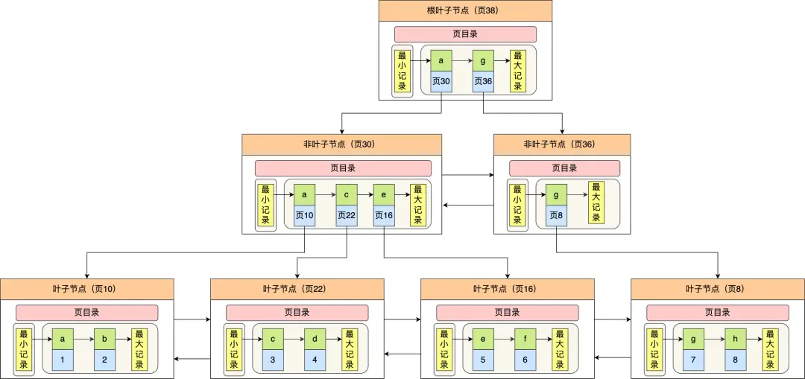
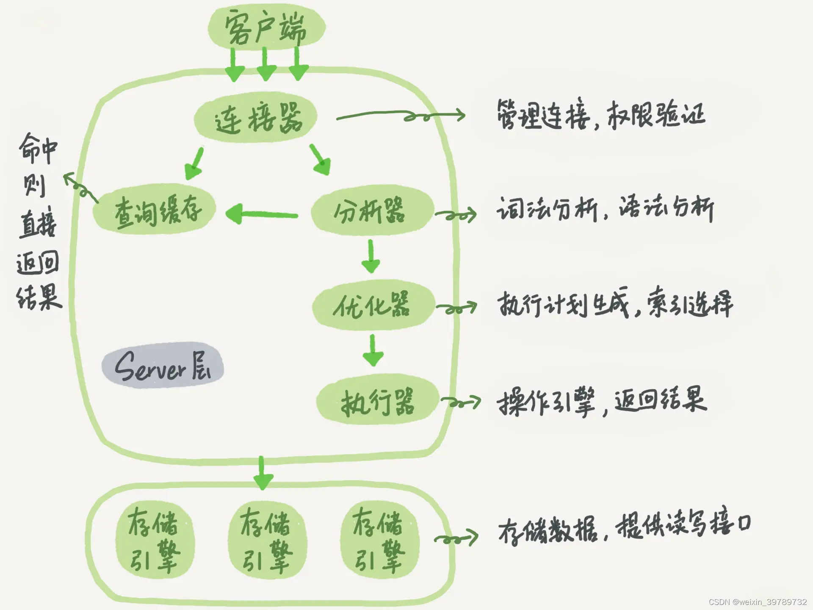

## 2023.3.20 美团 一面

### 1、非主键索引的叶子节点存储的是什么？

- 聚簇索引的叶子节点存放的是**实际数据**，**所有完整的用户记录都存放在聚簇索引的叶子节点；**
- 二级索引的叶子节点存放的是**主键值**，而不是实际数据。所以如果要查找的不是主键，还需要从二级索引查到对应的主键值去聚簇索引那回表（指通过主键查找到你需要的字段）。 下图为二级索引：



#### 聚簇索引生成规则

InnoDB 存储引擎一定会为表创建一个聚簇索引，且由于数据在物理上只会保存一份，所以聚簇索引只能有一个

- 如果有主键，默认会使用主键作为聚簇索引的索引键；
- 如果没有主键，就选择第一个不包含 NULL 值的唯一列作为聚簇索引的索引键；
- 在上面两个都没有的情况下，InnoDB 将自动生成一个隐式自增 id 列作为聚簇索引的索引键；

### 2、联合索引非最左匹配，无法使用索引

比如创建一个（a，b，c）联合索引，使用where b = 2 and c = 3时，无法使用到该联合索引。一下情况都会失效：

- where b=2；
- where c=3；
- where b=2 and c=3；

特殊的：where a = 1 and c = 3 

严格意义上来说是属于索引截断，不同版本处理方式也不一样。

MySQL 5.5 的话，前面 a 会走索引，在联合索引找到主键值后，开始回表，到主键索引读取数据行，Server 层从存储引擎层获取到数据行后，然后在 Server 层再比对 c 字段的值。

> MySQL分层：

从 MySQL 5.6 之后，有一个**索引下推功能**，可以在存储引擎层进行索引遍历过程中，对索引中包含的字段先做判断，直接过滤掉不满足条件的记录，再返还给 Server 层，从而减少回表次数。

> 索引下推的大概原理是：截断的字段不会在 Server 层进行条件判断，而是会被下推到「存储引擎层」进行条件判断（因为 c 字段的值是在 `(a, b, c)` 联合索引里的），然后过滤出符合条件的数据后再返回给 Server 层。由于在引擎层就过滤掉大量的数据，无需再回表读取数据来进行判断，减少回表次数，从而提升了性能。

### 3、事务ACID，以及具体解释

- Atomicity 原子性 

  过去原子被认为是分割的最小单位, 类比事务, 事务是一个不可分割的工作单位, 事务中的操作要么全部成功要么全部失败.

- Consistency 一致性
  事务总是能使得数据库从一个一致性状态转移到另一种一致性状态

- Isolation 隔离性
  即使在并发的执行事务时，事务之间不会造成相互影响

- Durability 持久性

  一旦事务提交，那么这个事务一定是生效的，即使后续遇到系统崩溃

### 4、快照读、是否加锁

id 主键索引，name 非主键索引

```sql
select * from xxx where name = '';
```

普通的 select 语句是不会对**记录加锁**的（除了串行化隔离级别），因为它属于快照读，是通过  MVCC（多版本并发控制）实现的。

如果要在查询时对记录加行级锁，可以使用下面这两个方式，这两种查询会加锁的语句称为**锁定读**。

```sql
//对读取的记录加共享锁(S型锁)
select ... lock in share mode;

//对读取的记录加独占锁(X型锁)
select ... for update;
```

上面这两条语句必须在一个事务中（不是指要同时使用的意思），**因为当事务提交了，锁就会被释放**，所以在使用这两条语句的时候，要加上 begin 或者 start transaction 开启事务的语句。

**除了上面这两条锁定读语句会加行级锁之外，update 和 delete 操作都会加行级锁，且锁的类型都是独占锁(X型锁)**。

```sql
//对操作的记录加独占锁(X型锁)
update table .... where id = 1;

//对操作的记录加独占锁(X型锁)
delete from table where id = 1;
```

```sql
//对操作的记录加独占锁(X型锁)
delete from xxx where name = '';
```

### 5、传输层存在的意义，为什么要有传输层，直接用IP不行吗？

传输层提供**应用进程之间的逻辑通信（即端到端的通信）**。与网络层的区别是，网络层提供的是主机之间的逻辑通信。

### 6、IP地址和MAC地址存在的意义？

各个设备之间传递数据时，需要使用到MAC地址以确定对方的身份（场景：两个路由器之间跳转，局域网内主机通信）。

各个网路之间通行需要使用到IP地址，主要是为了定位目的地址所在的位置，通过IP的分段机制推演出从源IP到目的IP的一条路径，而后数据包通过这条路径将数据送达。

**相当于MAC地址是身份证号，IP地址是住址，在网络通信时，通过住址发送邮件，再通过身份证号分发的具体人（设备）。**

IP是地址相关的，并且呢，在IP地址尚未分配时，需要MAC地址来区分不同的设备（比如DHCP分配IP阶段）。

### 7、一个客户端可以用一个端口连接不同端口上的服务器吗？（不考虑多IP）

可以的，但是可能存在不少的问题（如，发消息时不知道服务器到底是哪个端口），Linux下，一个socket连接根据五元组区分（传输协议、源IP地址、目的IP地址、源端口、目的端口），只要任何一个元素不同，就是一个新的连接。

Linux下，一个端口可以通过开启**SO_REUSEADDR**选项，允许**多个socket监听同一个IP和端口组合**。内部是通过负载均衡，哈希计算，匹配最佳得分的socket来分配新的连接

### 8、非阻塞IO和异步IO区别

阻塞和非阻塞是针对于进程在访问数据的时候，根据IO操作的就绪状态来采取的不同方式，说白了是一种读取或者写入操作函数的实现方式，阻塞方式下读取或者写入函数将一直等待，而非阻塞方式下，读取或者写入函数会立即返回一个状态值

同步或者异步I/O主要是指访问数据的机制(即实际I/O操作的完成方式)，同步一般指主动请求并等待I/O操作完毕的方式，I/O操作未完成前，会导致应用进程挂起；而异步是指用户进程触发IO操作以后便开始做自己的事情，而当IO操作已经完成的时候会得到IO完成的通知（异步的特点就是通知）,这可以使进程在数据读写时也不阻塞。

**形象的说法，非阻塞IO获取一个状态后，要主动轮询/询问数据是否准备完成（要饭吃），而异步IO是数据准备完成后操作系统通知你可以获取（喂饭吃）。**